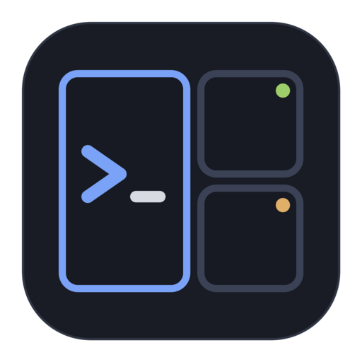
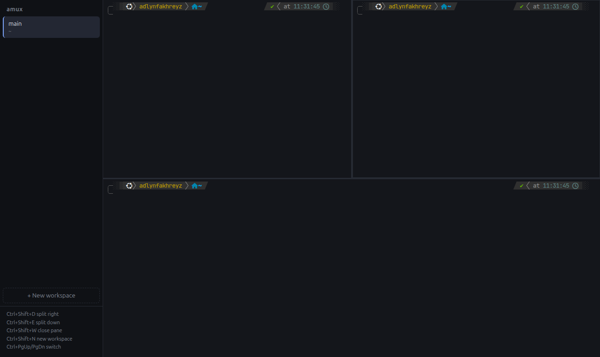

<p align="center"></p>

# amux

A [wmux](https://github.com/kevmtt/wmux)/[cmux](https://cmux.com)-style terminal multiplexer for Linux: a workspace sidebar, draggable split panes, and session persistence. cmux is macOS-only and wmux is Windows-only; amux fills that gap on Linux.



> Early stage (v0.1). Expect rough edges.

## Install

Download from [Releases](https://github.com/adlynfakhreyz/amux/releases):

- **.deb** (Ubuntu/Debian): `sudo apt install ./amux_0.1.0_amd64.deb`. Adds amux to your app menu with its icon.
- **AppImage** (any distro): `chmod +x amux-0.1.0-x86_64.AppImage && ./amux-0.1.0-x86_64.AppImage`. Needs FUSE (`sudo apt install libfuse2t64` on Ubuntu 24.04).

## Features

- Workspaces in a sidebar, each showing its current directory and git branch
- Split panes right/down, resize by dragging dividers
- Layout, sizes and each pane's directory are saved and restored on relaunch
- Bundled JetBrains Mono + Nerd Font symbols, so powerlevel10k/starship prompts render out of the box
- GPU (WebGL) rendering with pixel-aligned box and powerline glyphs

## Build from source

```bash
git clone https://github.com/adlynfakhreyz/amux.git && cd amux
npm install      # also rebuilds node-pty for Electron
npm run dev      # dev mode with hot reload
npm run dist     # build AppImage + .deb into dist/
```

`npm run dev` and `npm start` pass `--no-sandbox` because Ubuntu 24.04's AppArmor blocks Chromium's sandbox for unpackaged Electron. The .deb installs a proper setuid sandbox; the AppImage opts out of the sandbox automatically for the same reason.

## Shortcuts

| Keys | Action |
|---|---|
| Ctrl+Shift+D | Split active pane right |
| Ctrl+Shift+E | Split active pane down |
| Ctrl+Shift+W | Close active pane |
| Ctrl+Shift+N | New workspace |
| Ctrl+PgUp / Ctrl+PgDn | Previous / next workspace |
| Double-click workspace | Rename |

## Architecture

```
main process (Node)                         renderer (React)
├─ PtyManager: one shell per pane id  ⇄ IPC ⇄ ├─ Sidebar: workspaces, cwd, git branch
├─ session.ts: ~/.config/amux/session.json    ├─ SplitView: layout tree → resizable panels
└─ git.ts: branch per pane cwd                └─ TerminalPane → TerminalEngine (xterm.js today)
```

- **Layout** is a tree (`src/shared/types.ts`): splits (`row`/`column`, with sizes) and pane leaves. All edits are pure functions in `src/renderer/src/state/layout.ts`.
- **Terminal engine** is behind the `TerminalEngine` interface (`src/renderer/src/terminal/engine.ts`). xterm.js implements it now; the plan is to swap in libghostty-vt once its API is stable, without touching layout or sidebar code.
- **Registry** (`terminal/registry.ts`) keeps each pane's engine alive outside React, so splitting (which re-parents panes) never loses scrollback.
- **Persistence (v1)**: workspaces, splits, sizes and each pane's cwd (read from `/proc/<pid>/cwd`) are auto-saved and restored on launch. Shells start fresh on restore.

## Roadmap

1. Agent status in the sidebar: a local socket that Claude Code hooks report to (working / needs input / done), shown as dots per workspace.
2. Shells that survive closing the app: move PtyManager into a background daemon the app connects to.
3. Drag panes between splits and workspaces; drag-reorder workspaces.
4. AppArmor profile so the AppImage and dev builds can keep Chromium's sandbox.
5. Swap xterm.js for libghostty-vt.

## License

[MIT](LICENSE). Bundled fonts keep their own licenses (OFL-1.1 and MIT); see [THIRD_PARTY_NOTICES.md](THIRD_PARTY_NOTICES.md).
